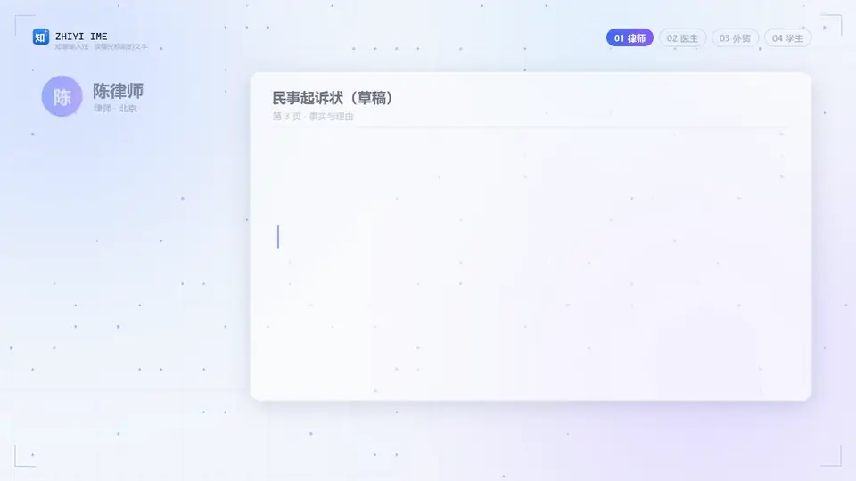
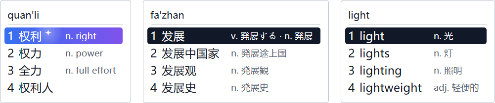
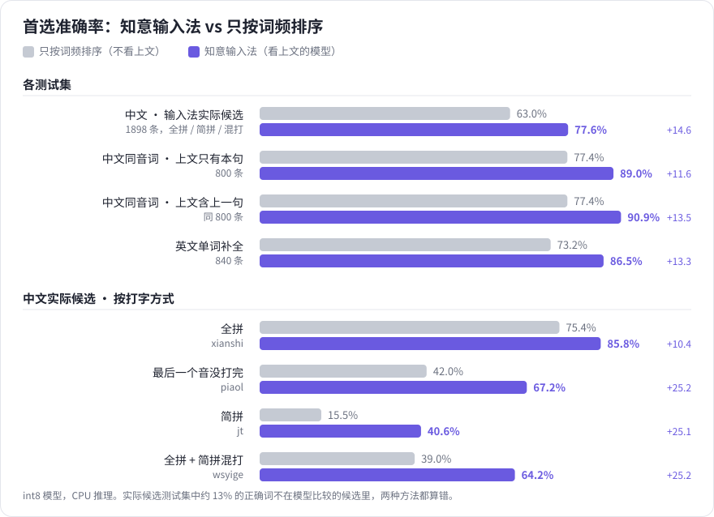
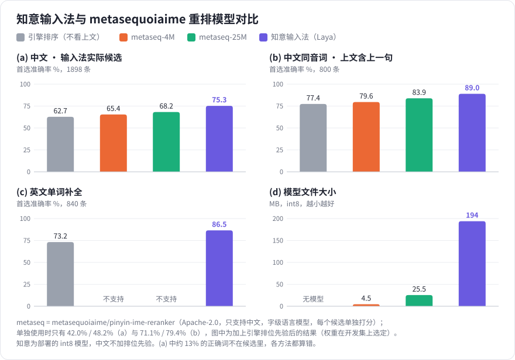

# 知意输入法（Zhiyi IME）

[English](README_EN.md) | **中文**

> 轻量 · 开源 · 懂上文 —— 根据光标前的文字推荐候选的 Windows 中英文输入法

<a href="docs/media/zhiyi-intro.mp4">▶ 观看宣传视频：四个人，四段前文（1 分 58 秒 · 中文配音 · 中英字幕）</a>

## 功能简介

- **懂上文的推荐**：一个在本机运行的小模型读取输入框里光标前的文字，从候选里挑出最可能的那个放在第一位，
  并用蓝紫色星标标出（如“权利 / 权力 / 全力”）。模型不联网，输入内容不会离开你的电脑；有独立显卡时可以
  在设置里改用显卡推理（DirectML，N 卡、A 卡、Intel 显卡都可以，先测速、比 CPU 快才使用）
- **学习模式（候选翻译）**：每个候选后面显示它的外语意思，前面标英文词性（n. v. adj. …），最多三个常用义项，
  打字时顺便学外语。中文候选可以翻成英、日、韩、法、德、西、俄语，英文候选可以翻成中、日、韩、法、德、西、俄语；
  多音字按读音分别翻译。翻译来自离线语言包（中文约 4 万词、英文约 2 万词），只在本机查表。安装包自带中 → 英、
  英 → 中，其余在设置的“学习”页按需下载。词表公开在 [zhiyi-glossary](https://github.com/dd1000001000/zhiyi-glossary)，
  欢迎纠错。词表里没有的词组、生僻词和短句，可以下载本机翻译模型（腾讯 Hy-MT2 1.8B）在显卡上翻译，
  一页的词同时翻、随后补上，不联网（需要显存大于 2 GB 的独立显卡）
- **数据位置可选**：词库、学习记录、语言包、模型缓存和下载的模型都可以放到别的盘，在“常规”页一键移动
- **拼音或五笔**：拼音支持全拼、首字母简拼和二者混合（`wsyige` → 我是一个），也可以切换成首字母模式
  （每个字母对应一个字，`zgr` → 中国人）
- **模糊音**：z=zh、c=ch、s=sh、n=l、an=ang、en=eng、in=ing 可以逐组开关，模糊匹配的词会标出正确拼音
- **英文输入**：单词联想（打几个字母就给出补全）或逐字母输入；打错时给出正确拼写，但不会自动替换
- **中英混输**：中文模式下打出完整的英文单词，该词会出现在候选里
- **自由设置切换键**：中英切换、输入方式、中英文标点、全角/半角都可以设置成自己习惯的按键，
  并提示与系统或其他程序快捷键的冲突
- **任务栏快速切换**：右键任务栏上的“中/英”可以切换中英文、全拼/首字母/五笔、标点、全角等，
  也可以“退出”后台服务（再次切换到知意输入法时自动启动）
- **候选窗口**：竖排（默认）或横排，浅色 / 深色主题，三档字号；中英文界面
- **自学习**：常用的词自动往前排，刚上屏就按退格可以撤销这次学习
- **备份与迁移**：把所有设置、词库和学习记录导出成一个文件，换电脑或重装后导入；备份不完整或损坏时什么都不导入
- **开机启动可选**：可以不在开机时启动后台服务，第一次切换到知意输入法时再启动
- **自动更新**：打开设置时检查新版本，一键下载、校验并安装；语言包也能单独检查更新
- **隐私**：可选的用户体验改进计划，默认关闭，记录只保存在本机，详见[隐私说明](docs/privacy.md)

## 推荐准确率

同样的候选，只按词频排序（不看上文）和知意输入法（看上文的模型）把正确的词放在第一位的比例。
打字越省事（简拼、最后一个音没打完），只靠词频越难猜中，看上文的提升也越大。测试方法见
[开发说明](docs/development.md#上文推荐模型laya)。

### 与其他开源模型对比

[metasequoiaime/pinyin-ime-reranker](https://huggingface.co/metasequoiaime/pinyin-ime-reranker-25M)（4M / 25M，Apache-2.0）是另一个给拼音候选按上文重新排序的开源模型。用同样的测试集、同样的候选比较：它体积小得多，但只支持中文，准确率低于知意的模型；英文补全只有知意支持。

## 安装说明

**系统要求**：Windows 10 / 11（64 位）。

1. 从 [Releases](https://github.com/dd1000001000/zhiyi_ime/releases/latest) 下载最新的
   `zhiyi-v版本号-setup.exe`，双击运行并按提示安装（需要管理员权限）。
2. 安装完成后按 `Win + 空格` 切换到“知意输入法”。也可以在“设置 > 时间和语言 > 语言和区域”中
   把它设为默认输入法。
3. 打开设置：右键任务栏上的“中/英”，选择“设置…”。

- **更新**：有新版本时，打开设置会提醒你，在“更新”页点“立即更新”即可。已经打开的程序要重新打开
  才会用上新版本。
- **换电脑或重装**：在设置的“词库”页“导出…”备份，到新电脑上“导入…”。
- **卸载**：在“设置 > 应用 > 已安装的应用”中卸载“知意输入法”，可以选择是否保留个人数据
  （位于 `%USERPROFILE%\zhiyi\`，包括设置、学习记录和下载的语言包）。

## 致谢

知意输入法基于 [CxxIME](https://github.com/deanxyuan/cxx-ime) 修改而来，感谢以下项目：

- [CxxIME](https://github.com/deanxyuan/cxx-ime)：输入法框架、拼音引擎、候选窗与设置程序（Apache License 2.0）
- [rime-ice（雾凇拼音）](https://github.com/iDvel/rime-ice)：中文拼音词库与英文词表（GPL-3.0）
- [Laya](https://huggingface.co/convaiinnovations/laya)：上文推荐所用的模型（Apache-2.0）
- [wordfreq](https://github.com/rspeer/wordfreq)：英文词频（CC BY-SA 4.0）
- [ONNX Runtime](https://github.com/microsoft/onnxruntime)：模型推理（MIT）
- [DirectML](https://github.com/microsoft/DirectML)：显卡推理（微软 DirectML 许可，可再分发）

学习模式的语言包由大语言模型（GLM、Gemma）离线生成后经自动检查和人工修订，词表按 GPL-3.0 公开在
[zhiyi-glossary](https://github.com/dd1000001000/zhiyi-glossary)。

知意输入法按 [GPL-3.0-only](LICENSE) 发布，各组件的完整声明见 [NOTICE](NOTICE) 和
[THIRD_PARTY_NOTICES.txt](THIRD_PARTY_NOTICES.txt)。开发与构建说明见 [docs/development.md](docs/development.md)。
