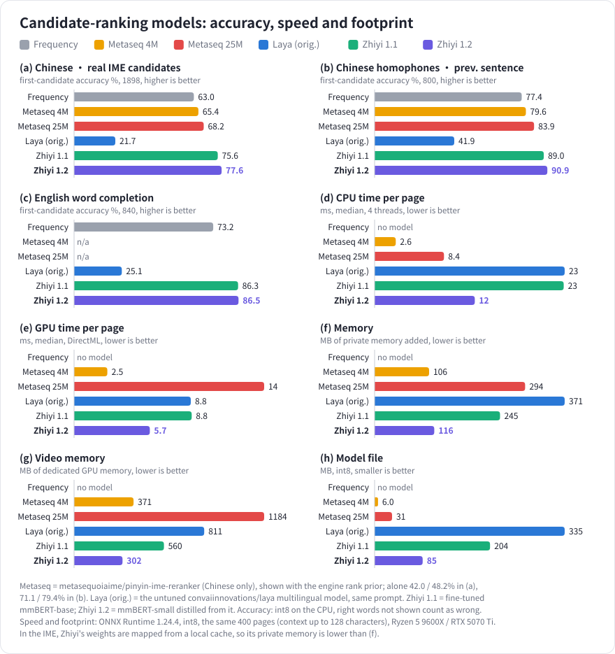

# Zhiyi IME (知意输入法)

**English** | [中文](README.md)

> Lightweight · Open source · Context-aware — a Windows Chinese/English input method that picks
> candidates by the text before the caret

<a href="docs/media/zhiyi-intro.mp4">▶ Watch the intro video: four people, four stories (1:58 · Chinese voices · Chinese and English subtitles)</a>

## Features

- **Context-aware recommendation**: a small model running on your computer reads the text before
  the caret, puts the most likely candidate first and marks it with a blue-purple star (权利 / 权力 /
  全力). The model works offline; nothing you type leaves your computer. With a dedicated graphics
  card the model can run on it instead (DirectML: NVIDIA, AMD and Intel cards; Settings tests the
  speed first and uses the card only when it is faster than the CPU).
- **Learning mode (candidate translations)**: each candidate shows what it means in another language,
  with English part-of-speech labels (n. v. adj. …) and up to three common senses, so you pick up a
  language while typing. Chinese candidates can be shown in English, Japanese, Korean, French,
  German, Spanish or Russian, English candidates in Chinese, Japanese, Korean, French, German, Spanish
  or Russian; words with several readings are translated by reading. Translations come from offline
  language packs (about 40,000 Chinese and 20,000 English words) looked up on your computer. The
  installer includes Chinese → English and English → Chinese; the others are downloaded on the
  Learning page in Settings. The word lists are open at
  [zhiyi-glossary](https://github.com/dd1000001000/zhiyi-glossary): corrections welcome. Phrases,
  rare words and short sentences the packs lack can be translated by a downloadable on-device model
  (Tencent Hy-MT2 1.8B) on the graphics card: a page at once, filled in as it arrives, offline
  (needs a dedicated card with more than 2 GB of memory).
- **Choose where data lives**: the user dictionary, learning records, language packs, model caches
  and downloaded models can move to another drive with one click on the General page.
- **Pinyin or Wubi**: pinyin accepts full pinyin, initials and a mix of both (`wsyige` → 我是一个),
  plus an initials mode where each letter is one character (`zgr` → 中国人).
- **Fuzzy pinyin**: z=zh, c=ch, s=sh, n=l, an=ang, en=eng, in=ing, each pair on or off; words found
  through a fuzzy pair show their correct pinyin.
- **English input**: word completion or letter by letter; misspelled words get their correct spelling
  as a candidate, never replaced automatically.
- **Mixed input**: a complete English word typed in Chinese mode is offered among the candidates.
- **Your own switch keys** for Chinese/English, input style, punctuation and full/half width, with
  warnings about conflicts with Windows or other programs.
- **Taskbar menu**: right-click the 中/英 indicator to switch Chinese/English, full pinyin / initials /
  Wubi, punctuation, full width and more, or to exit the background service (it starts again when you
  switch to Zhiyi IME).
- **Candidate window**: vertical (default) or horizontal, light and dark themes, three font sizes;
  Chinese and English interface.
- **Self-learning**: words you use move up; Backspace right after a commit undoes what it learned.
- **Backup and transfer**: export all settings, the lexicon and the learning records to one file and
  import it on another computer or after reinstalling; nothing is imported from an incomplete or
  damaged backup.
- **Optional start at sign-in**: the background service can start the first time you switch to
  Zhiyi IME instead.
- **Automatic updates**: Settings checks for a new version when it opens and installs it in one click;
  language packs have their own update check.
- **Privacy**: an optional user experience program, off by default, with records kept on your computer
  only; see the [privacy notes](docs/privacy.en.md).

## Recommendation accuracy

How often the right word comes first, and how fast and how large each model is, on the same test sets and the same candidates: word frequency only (no context), [metasequoiaime/pinyin-ime-reranker](https://huggingface.co/metasequoiaime/pinyin-ime-reranker-25M) (4M / 25M, another open model that reranks pinyin candidates by the preceding text; Chinese only), the untuned multilingual [Laya](https://huggingface.co/convaiinnovations/laya) model, and the models of Zhiyi 1.1 and 1.2. The 1.2 model is the 1.1 model distilled into the smaller mmBERT-small, with more training text from LCCC and Chinese C4: it is more accurate, about twice as fast on the CPU, and takes about half the memory, video memory and disk space. Test details are in the [development notes](docs/development.md#上文推荐模型laya) (Chinese).

## Installation

**Requirements**: Windows 10 / 11 (64-bit).

1. Download the latest `zhiyi-v<version>-setup.exe` from
   [Releases](https://github.com/dd1000001000/zhiyi_ime/releases/latest) and run it (administrator
   approval is needed).
2. Press `Win + Space` to switch to Zhiyi IME, or make it the default input method in Windows Settings
   > Time & language > Language & region.
3. To open Settings, right-click 中/英 on the taskbar and choose Settings….

- **Updates**: when a new version is out, Settings tells you; click Update now on its Updates page.
  Programs already open use the new version after they are reopened.
- **Moving to another computer or reinstalling**: Export… on the Dictionary page of Settings, then
  Import… on the new computer.
- **Uninstalling**: uninstall Zhiyi IME in Windows Settings > Apps > Installed apps; you can keep your
  personal data (settings, learned words and downloaded language packs in `%USERPROFILE%\zhiyi\`).

## Credits

Zhiyi IME is a modified version of [CxxIME](https://github.com/deanxyuan/cxx-ime). Thanks to:

- [CxxIME](https://github.com/deanxyuan/cxx-ime): the input method framework, pinyin engine,
  candidate window and settings app (Apache License 2.0)
- [rime-ice](https://github.com/iDvel/rime-ice): the Chinese pinyin dictionary and English word list (GPL-3.0)
- [Laya](https://huggingface.co/convaiinnovations/laya): the recommendation model's architecture and the teacher it was distilled from (Apache-2.0)
- [mmBERT](https://huggingface.co/jhu-clsp/mmBERT-small): the recommendation model's encoder, mmBERT-small (MIT)
- [LCCC](https://github.com/thu-coai/CDial-GPT) (MIT) and the Chinese part of [C4](https://huggingface.co/datasets/allenai/c4) (ODC-BY): part of the distillation text
- [wordfreq](https://github.com/rspeer/wordfreq): English word frequencies (CC BY-SA 4.0)
- [ONNX Runtime](https://github.com/microsoft/onnxruntime): model inference (MIT)
- [DirectML](https://github.com/microsoft/DirectML): inference on graphics cards (Microsoft DirectML
  license, redistributable)

The learning-mode language packs were generated offline by large language models (GLM, Gemma), then
checked automatically and corrected by hand; the word lists are open under GPL-3.0 at
[zhiyi-glossary](https://github.com/dd1000001000/zhiyi-glossary).

Zhiyi IME is licensed under [GPL-3.0-only](LICENSE); full notices are in [NOTICE](NOTICE) and
[THIRD_PARTY_NOTICES.txt](THIRD_PARTY_NOTICES.txt). Development and build notes:
[docs/development.md](docs/development.md).
